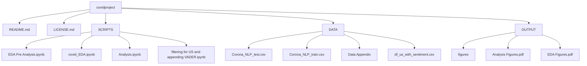

# COVID-19 Tweet Sentiment Analysis

## Goal: 
Investigate whether the sentiments of Twitter comments surrounding COVID-19 were more positive or negative the day of or a few weeks after states began implementing major shutdowns on March 15, 2020. 

## Software and Platform Section
**Types of Software Used:**
  - Programming Language: Python
  - Data Processing & Analysis: Pandas
    - Reading, cleaning, and filtering the dataset
    - Aggregating tweet counts and sentiment scores
  - Natural Language Processing (NLP): NLTK (VADER)
    - Used nltk (Natural Language Toolkit) library 
    - Sentiment analysis using VADER
      - Assigns a compound sentiment score to each tweet
      - Helps understand public mood about topic
      - Documentation for the VADER package: https://www.geeksforgeeks.org/python-sentiment-analysis-using-vader/. 
  - Data Visualization: Matplotlib & Seaborn
    - Creating bar charts, scatter plots, and other custom visualization aesthetics
  - Data Storage & Export: CSV Files
  - Cloud Computing: Google Colab
    
**Packages Installed:**
  - pandas
  - numpy
  - matplotlib
  - seaborn
  - nltk
    
**Platforms Used:** Windows & Mac

## Map of Documentation

## Instructions for Reproducing Results

## References
[1] GeeksforGeeks. (2024, December, 11). “Sentiment Analysis using VADER” [Online]. Available:
https://www.geeksforgeeks.org/python-sentiment-analysis-using-vader/

[2] Datatattle. (2020). “COVID-19 NLP Text Classification Dataset” [Online]. Available:
https://www.kaggle.com/datasets/datatattle/covid-19-nlp-text-classification

